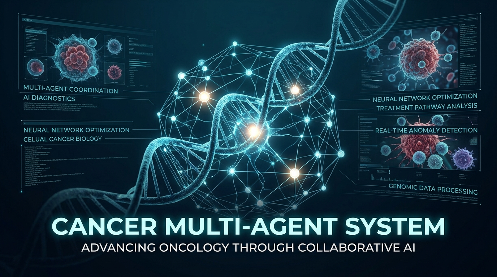
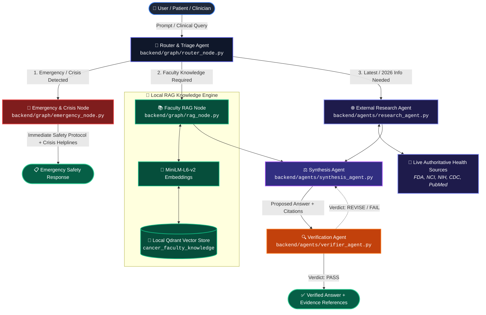
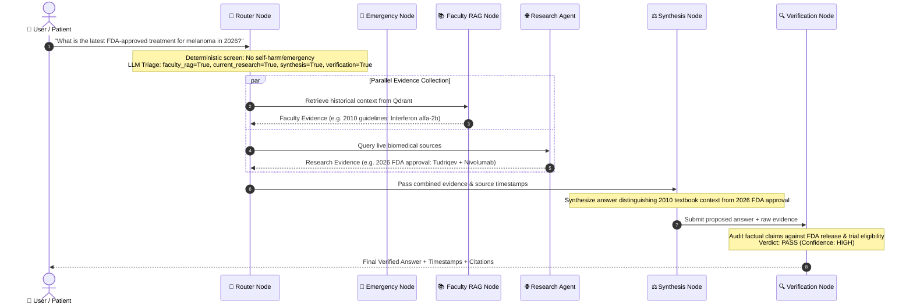

<div align="center">



# Cancer Multi-Agent System 🧬🤖

**An Autonomous, State-Driven Multi-Agent Framework & High-Precision Oncology RAG Engine**

[](https://www.python.org/)
[](https://fastapi.tiangolo.com/)
[](https://qdrant.tech/)
[](https://huggingface.co/sentence-transformers/all-MiniLM-L6-v2)
[](https://langchain-ai.github.io/langgraph/)
[](#-security-privacy--zero-phi-guarantee)
[](LICENSE)

<p align="center">
  <a href="#-executive-overview">Executive Overview</a> •
  <a href="#-system-architecture--state-graph">State Graph Architecture</a> •
  <a href="#-specialized-agent-roster">Agent Roster</a> •
  <a href="#-crisis--emergency-safety-guardrail">Emergency Safety</a> •
  <a href="#-biomedical-rag-pipeline">Biomedical RAG</a> •
  <a href="#-vector-database--retrieval-layer">Qdrant Storage</a> •
  <a href="#-verification-and-synthesis">Synthesis & Verification</a> •
  <a href="#️-quickstart-guide">Quickstart</a>
</p>

</div>

---

## 📌 Table of Contents

- [🌟 Executive Overview](#-executive-overview)
  - [The Clinical Problem](#the-clinical-problem)
  - [The Multi-Agent Solution](#the-multi-agent-solution)
- [🏛️ System Architecture & State Graph](#️-system-architecture--state-graph)
- [👥 Specialized Agent Roster](#-specialized-agent-roster)
- [🛡️ Crisis & Emergency Safety Guardrail](#️-crisis--emergency-safety-guardrail)
- [🔄 Multi-Agent Workflow & Control Flow](#-multi-agent-workflow--control-flow)
- [🔬 Biomedical RAG Pipeline (v6 Engine)](#-biomedical-rag-pipeline-v6-engine)
  - [End-to-End Ingestion Flow](#end-to-end-ingestion-flow)
  - [Pipeline Processing Stages](#pipeline-processing-stages)
- [💾 Vector Database & Retrieval Layer](#-vector-database--retrieval-layer)
- [⚖️ Synthesis & Verification Engine](#️-synthesis--verification-engine)
- [📊 Evaluation & Grounding Benchmarks](#-evaluation--grounding-benchmarks)
- [📂 Repository Structure](#-repository-structure)
- [⚙️ Quickstart Guide](#️-quickstart-guide)
  - [1. Prerequisites](#1-prerequisites)
  - [2. Installation & Virtual Environment](#2-installation--virtual-environment)
  - [3. Running the RAG Ingestion Pipeline](#3-running-the-rag-ingestion-pipeline)
  - [4. Testing Agents & Safety Guardrails](#4-testing-agents--safety-guardrails)
  - [5. Launching the Backend API](#5-launching-the-backend-api)
- [🔌 API Reference](#-api-reference)
- [🛣️ Development Roadmap](#️-development-roadmap)
- [🔒 Security, Privacy & Zero-PHI Guarantee](#-security-privacy--zero-phi-guarantee)
- [⚠️ Clinical & Ethical Disclaimer](#️-clinical--ethical-disclaimer)

---

## 🌟 Executive Overview

### The Clinical Problem
Oncological data is uniquely complex, rapidly evolving, and safety-critical:
- **Literature Explosion & Recency Gap**: Tens of thousands of oncology trials are published annually. Core institutional knowledge (e.g., textbook guidelines) provides deep foundational concepts but may be outdated for recent FDA approvals (such as 2026 targeted therapies or novel immunotherapies).
- **High Consequence of Hallucination**: Generic LLMs hallucinate treatment regimens, invent non-existent PubMed citations, and miss life-threatening drug-drug interactions.
- **Mental Health & Medical Crisis Vulnerability**: Cancer patients frequently experience severe psychological distress or sudden acute toxicities, demanding deterministic emergency safety intercepts before generating standard informational text.

### The Multi-Agent Solution
The **Cancer Multi-Agent System** solves these challenges using a stateful, graph-based architecture:
1. **Deterministic Safety-First Triage**: Intercepts crises and emergencies before general querying.
2. **Temporal Grounding**: Explicitly distinguishes between historical institutional knowledge (e.g. Faculty textbooks from 2010/2018) and real-time external research (e.g. 2026 FDA approvals).
3. **Dual-Layer Validation**: All proposed answers pass through an independent Verification Agent that evaluates factual claims against retrieved evidence with strict `PASS`, `FAIL`, or `REVISE` verdicts.

<div align="center">
  
  <p><em>Figure 1: Conceptual overview of the Multi-Agent Cancer Assistant orchestrating specialized agents and safety guardrails.</em></p>
</div>

---

## 🏛️ System Architecture & State Graph

The system is coordinated via a stateful execution graph (`AgentState` defined in `backend/graph/state.py`) managing the global execution context across nodes:



---

## 👥 Specialized Agent Roster

Each agent in the system is implemented with strict domain boundaries, typed data contracts, and deterministic safety rules:

| Agent Persona | Module Path | Core Responsibilities | Evidence & Grounding Source |
| :--- | :--- | :--- | :--- |
| **🧭 Router / Triage Agent** | `backend/agents/router_agent.py`<br>`backend/graph/router_node.py` | Analyzes user intent, prioritizes emergency triage over general queries, detects required knowledge domains, and outputs a typed `RouterDecision`. | Deterministic rule-screening + Structured LLM Classification |
| **🚨 Emergency & Safety Agent** | `backend/agents/emergency_agent.py`<br>`backend/safety/emergency_rules.py` | Detects self-harm, suicidal distress, and acute medical red flags; bypasses general RAG to provide calm, immediate safety instructions and crisis resources. | Deterministic Regex Keywords + Safe De-escalation Protocol |
| **📚 Faculty RAG Agent** | `backend/rag/rag_agent.py`<br>`backend/graph/rag_node.py` | Queries local persistent Qdrant database, extracts semantic chunks, attributes page-level citations, and flags historical publication years (e.g. 2010/2018). | Local Qdrant Store (`cancer_faculty_knowledge`) |
| **🌐 External Research Agent** | `backend/agents/research_agent.py` | Researches emerging oncology updates, newly approved 2026 therapies, and official regulatory changes with strict source date verification. | Live Web Tools + FDA, NCI, NIH, CDC Databases |
| **⚖️ Synthesis Agent** | `backend/agents/synthesis_agent.py` | Consolidates multi-source evidence into a cohesive, patient-friendly answer; explicitly highlights temporal differences and caveats without diagnosing or prescribing. | Provided Faculty RAG & External Research Evidence Only |
| **🔍 Verification Agent** | `backend/agents/verifier_agent.py` | Independently verifies proposed answers against supplied evidence, flags unsupported claims or omitted limitations, and issues structured `PASS`/`FAIL`/`REVISE` verdicts. | Raw Evidence Claims & Source Metadata |

---

## 🛡️ Crisis & Emergency Safety Guardrail

The system enforces a **Safety-First Architecture**:
- **Deterministic Keyword Screener (`backend/safety/emergency_rules.py`)**:
  - Scans for self-harm keywords, suicidal expressions (*"want to die"*, *"unbearable"*, *"end it all"*), and severe medical emergencies (*"cannot breathe"*, *"severe chest pain"*).
- **Offline Fallback Guarantee**: If external LLM APIs are unreachable or rate-limited, the system executes an offline deterministic safety protocol (`emergency_node_test_offline.py`) to guarantee immediate patient safety guidance.
- **Strict Clinical Boundaries**:
  - Never provides means or methods of self-harm.
  - Never promises false outcomes.
  - Prioritizes crisis contact numbers and human connection above information retrieval.

---

## 🔄 Multi-Agent Workflow & Control Flow

The `AgentState` TypedDict passes state across graph nodes with clear trace logs:



---

## 🔬 Biomedical RAG Pipeline (v6 Engine)

To ground agent decisions in institutional cancer literature, the repository features a high-throughput, noise-filtered RAG pipeline.

### End-to-End Ingestion Flow

```mermaid
flowchart TD
    classDef pdfStyle fill:#831843,stroke:#ec4899,stroke-width:2px,color:#fff
    classDef filterStyle fill:#1e293b,stroke:#eab308,stroke-width:2px,color:#fff
    classDef chunkStyle fill:#0f172a,stroke:#3b82f6,stroke-width:2px,color:#fff
    classDef embedStyle fill:#064e3b,stroke:#10b981,stroke-width:2px,color:#fff
    classDef dbStyle fill:#312e81,stroke:#a855f7,stroke-width:2px,color:#fff

    PDFs[📄 Raw Oncology Textbooks & Guidelines<br><code>data/raw_pdfs/*.pdf</code>]:::pdfStyle --> Loader[📑 PDF Loader<br><code>backend/rag/pdf_loader.py</code>]:::filterStyle
    
    Loader -->|Page Records + Document Metadata| Chunker[✂️ Intelligent Chunker v3<br><code>backend/rag/chunker_v3.py</code>]:::chunkStyle
    
    subgraph ChunkingOpt ["📏 Section-Aware Chunking"]
        Chunker --> S1[Abbreviation Protection: <em>e.g., i.e., Dr., Fig., vs.</em>]
        Chunker --> S2[Heading Detection: Chapters, Roman & Decimal Headers]
        Chunker --> S3[Bounded Windows: Target 1400 | Max 2200 | Min 300 chars]
    end

    Chunker -->|chunks.jsonl| Filter[🧹 Content Filter v6<br><code>backend/rag/content_filter.py</code>]:::filterStyle
    
    subgraph HeuristicFiltering ["🧼 Precision Noise Removal"]
        Filter -.->|Strip| F1[Author Affiliations & Medical Degrees]
        Filter -.->|Strip| F2[Acknowledgments & Gratitude Phrases]
        Filter -.->|Strip| F3[Publisher Copyrights & ISBNs]
        Filter -.->|Strip| F4[Table of Contents & Index Directories]
        Filter -.->|Strip| F5[Numbered Reference Lists & Raw Bibliographies]
        Filter -.->|Strip| F6[Low Information / Truncated Paragraphs]
    end
    
    Filter -->|clean_chunks.jsonl| Embedder[🧠 Dense Vector Embedder<br><code>backend/rag/embed_chunks.py</code>]:::embedStyle
    
    Embedder -->|all-MiniLM-L6-v2 | VectorStore[(💾 Qdrant Vector Store<br><code>backend/rag/qdrant_store.py</code>)]:::dbStyle
```

### Pipeline Processing Stages

1. **PDF Ingestion & Page Citation (`pdf_loader.py`)**:
   - Preserves document name and page number for every page.
2. **Section-Aware Chunking (`chunker_v3.py`)**:
   - Tokenizes text into bounded chunks with deterministic chunk IDs: `{document}-p{page}-c{index}`.
3. **Advanced Medical Content Filter (`content_filter.py` - v6)**:
   - Evaluates multi-signal criteria to strip author affiliations, copyright boilerplate, dot-leader TOCs, and unparsed reference lists while preserving actual medical discussion.
4. **Dense Vector Embeddings (`embed_chunks.py` / `embeddings.py`)**:
   - Generates 384-dimensional normalized embeddings with `sentence-transformers/all-MiniLM-L6-v2`.
5. **Semantic Retrieval Engine (`retrieve.py`)**:
   - Executes cosine similarity search with score ranking and metadata formatting.

---

## 💾 Vector Database & Retrieval Layer

The knowledge base is indexed in a local, persistent **Qdrant** database (`backend/rag/qdrant_store.py`):

```
data/qdrant/
├── collections/
│   └── cancer_faculty_knowledge/
│       ├── vectors (384-dim, Cosine Similarity)
│       └── payload (chunk_id, document, page_start, page_end, section, text, source_type, source_year)
```

- **Collection**: `cancer_faculty_knowledge`
- **Vector Dimension**: `384`
- **Metric**: `Cosine Distance`
- **Point IDs**: Deterministic `UUIDv5` generated from `chunk_id` for idempotent indexing.

---

## ⚖️ Synthesis & Verification Engine

### Synthesis Agent (`synthesis_agent.py`)
- Blends historical faculty evidence with modern web research.
- Explicitly warns when faculty knowledge reflects historical standards of care (e.g. 2010) that have since been superseded.
- Never diagnoses or prescribes.

### Verification Agent (`verifier_agent.py`)
- Evaluates the proposed text against raw retrieved context.
- Generates structured verification outputs:
```
VERDICT: PASS
CONFIDENCE: HIGH
SUPPORTED CLAIMS:
- FDA accelerated approval of Tudriqev on August 6, 2026.
- Combination therapy with Nivolumab for PD-1 refractory advanced cutaneous melanoma.
UNSUPPORTED OR PROBLEMATIC CLAIMS:
- None.
MISSING INFORMATION:
- None.
RECOMMENDED ACTION: PASS
```

---

## 📊 Evaluation & Grounding Benchmarks

| Metric Category | Target Metric | Definition / Standard | Target Threshold |
| :--- | :--- | :--- | :--- |
| **Evidence Grounding** | **Citation Precision** | $\frac{\text{Valid Citations}}{\text{Total Citations Generated}} \times 100\%$ | $\ge 98.0\%$ |
| **Anti-Hallucination** | **Hallucination Rate** | $\frac{\text{Fabricated Claims}}{\text{Total Claims}} \times 100\%$ | $\mathbf{0.0\%}$ |
| **Safety Intercept** | **Crisis Recall** | $\frac{\text{Detected Crises}}{\text{Total Crisis Vignettes}} \times 100\%$ | $\mathbf{100.0\%}$ |
| **Temporal Fidelity** | **Source Year Accuracy** | Distinguishing pre-2020 guidelines vs. 2026 approvals | $\ge 95.0\%$ |
| **Verification Gate** | **Audit Accuracy** | Correct identification of ungrounded statements | $\ge 95.0\%$ |

---

## 📂 Repository Structure

```
cancer-multi-agent/
├── assets/                             # Visual branding & high-resolution diagrams
│   ├── hero-banner.jpg                 # Project hero banner
│   └── virtual-tumor-board.jpg         # Virtual Tumor Board infographic
│
├── backend/                            # Core application services
│   ├── __init__.py
│   ├── ai_service.py                   # Direct LLM invocation helpers
│   ├── config.py                       # Environment variables & OpenAI API keys
│   ├── main.py                         # FastAPI REST application
│   │
│   ├── agents/                         # Autonomous Specialized Agents
│   │   ├── router_agent.py             # Intent triage & agent selection
│   │   ├── emergency_agent.py          # Crisis de-escalation & safety protocol
│   │   ├── research_agent.py           # Live authoritative web research
│   │   ├── synthesis_agent.py          # Multi-evidence answer synthesis
│   │   └── verifier_agent.py           # Independent factual validation & auditing
│   │
│   ├── graph/                          # LangGraph Nodes & State Execution
│   │   ├── state.py                    # Shared AgentState TypedDict definition
│   │   ├── state_test.py               # State schema validation tests
│   │   ├── router_node.py              # Routing node execution
│   │   ├── emergency_node.py           # Safety intercept execution node
│   │   ├── emergency_node_test_offline.py # Offline deterministic safety test
│   │   ├── rag_node.py                 # Faculty RAG node execution
│   │   ├── rag_node_test_offline.py    # Offline RAG node test
│   │   └── research_pipeline_test.py   # Multi-agent research pipeline test
│   │
│   ├── safety/                         # Safety rules & deterministic engines
│   │   └── emergency_rules.py          # Regex patterns for crisis detection
│   │
│   └── rag/                            # Production-Grade Medical RAG Pipeline
│       ├── __init__.py
│       ├── pdf_loader.py               # PDF ingestion with page-level tracking
│       ├── chunker_v3.py               # Section-aware medical text chunker
│       ├── content_filter.py           # Noise, contributor & bibliography filter (v6)
│       ├── embeddings.py               # Single embedding generator
│       ├── embed_chunks.py             # Batch vector generation pipeline
│       ├── qdrant_store.py             # Persistent local Qdrant collection builder
│       ├── retrieve.py                 # Semantic retrieval & cosine similarity engine
│       ├── rag_agent.py                # Standalone Faculty RAG agent with citations
│       ├── find_reference_chunks.py    # Bibliography detection audit tool
│       ├── inspect_chunks.py           # Quick chunk inspection utility
│       ├── inspect_removed_chunks.py   # Filtered noise inspection utility
│       └── chunk_inspector.py          # Token count & length distribution analyzer
│
├── data/                               # Data directory (managed & gitignored)
│   ├── raw_pdfs/                       # Raw oncology textbooks (.gitkeep tracked)
│   ├── processed/                      # Chunks (chunks.jsonl, clean_chunks.jsonl, embedded_chunks.jsonl)
│   └── qdrant/                         # Persistent local Qdrant vector database
│
├── docs/                               # Engineering documentation & ADRs
│   ├── ARCHITECTURE.md                 # System architecture specifications
│   ├── DECISIONS.md                    # Architecture Decision Records (ADR-001 - ADR-004)
│   ├── EVALUATION.md                   # Evaluation framework & benchmark metrics
│   ├── PROJECT_STATE.md                # Sprint progress & roadmap tracking
│   ├── PROJECT_HANDOFF.md              # Engineering handoff & codebase summary
│   ├── PROMPT_REGISTRY.md              # Versioned system prompts & persona catalogs
│   └── assets/                         # Documentation visual asset mirrors
│
├── prompts/                            # Standalone prompt templates
├── tests/                              # Automated test suites
├── .env.example                        # Example environment configuration
├── .gitignore                          # Git ignore definitions
└── README.md                           # Master repository documentation
```

---

## ⚙️ Quickstart Guide

### 1. Prerequisites
- **Python**: Version 3.11+
- **Git**

### 2. Installation & Virtual Environment

```bash
# Clone the repository
git clone https://github.com/Snigdha-0210/Cancer-multi-agent.git
cd Cancer-multi-agent

# Create and activate virtual environment
python -m venv .venv

# On Windows:
.venv\Scripts\activate

# On Linux / macOS:
# source .venv/bin/activate

# Install required packages
pip install fastapi uvicorn pydantic openai sentence-transformers qdrant-client pypdf
```

### 3. Running the RAG Ingestion Pipeline

Place your oncology guideline PDFs inside `data/raw_pdfs/` and run the ingestion pipeline:

```bash
# Step 1: Chunk PDFs with section detection and abbreviation safety
python -m backend.rag.chunker_v3

# Step 2: Filter noise, contributor lists, and bibliographies (v6)
python -m backend.rag.content_filter

# Step 3: Generate 384-dimensional dense embeddings
python -m backend.rag.embed_chunks

# Step 4: Index and upsert vectors into local Qdrant database
python -m backend.rag.qdrant_store
```

### 4. Testing Agents & Safety Guardrails

```bash
# Test deterministic offline emergency detection
python -m backend.graph.emergency_node_test_offline

# Test semantic retrieval from Qdrant
python -m backend.rag.retrieve

# Test router triage decisions
python -m backend.agents.router_agent

# Test offline Faculty RAG node
python -m backend.graph.rag_node_test_offline
```

### 5. Launching the Backend API

Create a `.env` file in the project root:
```env
OPENAI_API_KEY=your_openai_api_key_here
```

Start the FastAPI development server:
```bash
uvicorn backend.main:app --reload --host 127.0.0.1 --port 8000
```

Access the interactive Swagger UI at **[http://127.0.0.1:8000/docs](http://127.0.0.1:8000/docs)**.

---

## 🔌 API Reference

### Health Check
`GET /health`
```json
{
  "status": "healthy"
}
```

### Ask AI Endpoint
`POST /ask`
```bash
curl -X POST "http://127.0.0.1:8000/ask" \
     -H "Content-Type: application/json" \
     -d '{"question": "What are the risk factors for melanoma?"}'
```

**Sample Response**:
```json
{
  "question": "What are the risk factors for melanoma?",
  "answer": "According to faculty oncology guidelines, major risk factors for melanoma include extensive ultraviolet (UV) radiation exposure, history of severe sunburns, fair skin phenotype (Fitzpatrick skin types I-II), high melanocytic nevus counts, presence of atypical dysplastic nevi, and family history of melanoma...",
  "sources": [
    {
      "document": "managing-skin-cancer-2010.pdf",
      "pages": "12-15",
      "source_year": 2010
    }
  ]
}
```

---

## 🛣️ Development Roadmap

- [x] **Phase 1: Architecture & Foundation**
  - [x] State schema definition (`backend/graph/state.py`).
  - [x] System documentation & ADRs (`docs/DECISIONS.md`, `docs/ARCHITECTURE.md`).
  - [x] Versioned prompt catalog (`docs/PROMPT_REGISTRY.md`).
- [x] **Phase 2: High-Precision Medical RAG & Vector Engine**
  - [x] PDF loader with page-level citation retention (`pdf_loader.py`).
  - [x] Intelligent section-aware chunker (`chunker_v3.py`).
  - [x] Multi-signal medical content filter v6 (`content_filter.py`).
  - [x] Dense vector pipeline with `all-MiniLM-L6-v2` (`embed_chunks.py`).
  - [x] Persistent local Qdrant collection builder (`qdrant_store.py`).
  - [x] Semantic cosine similarity retrieval engine (`retrieve.py`).
- [x] **Phase 3: Multi-Agent Specialization & Safety Guardrails**
  - [x] Router & Triage Agent with structured intent routing (`router_agent.py`).
  - [x] Deterministic Emergency & Crisis Safety Guardrail with offline fallback (`emergency_agent.py`, `emergency_rules.py`).
  - [x] Live external research agent with source validation (`research_agent.py`).
  - [x] Multi-source consensus synthesis agent (`synthesis_agent.py`).
  - [x] Independent verification & hallucination auditing agent (`verifier_agent.py`).
- [ ] **Phase 4: Full LangGraph Compilation & Clinician UI**
  - [ ] End-to-end compiled LangGraph application with streaming responses.
  - [ ] Web-based Virtual Tumor Board review dashboard.
  - [ ] Automated evaluation test suite with NCBI PMID validator (`tests/eval_citations.py`).

---

## 🔒 Security, Privacy & Zero-PHI Guarantee

- **Zero Protected Health Information (PHI) Storage**: Incoming queries are processed with strict de-identification rules.
- **Local On-Premises Vector Retrieval**: Faculty clinical guideline embeddings are stored and searched locally in Qdrant with zero third-party vector transmission.
- **Safety Intercept Priority**: Crisis inputs immediately halt downstream agent execution to provide essential life-safety protocols.

---

## ⚠️ Clinical & Ethical Disclaimer

> [!IMPORTANT]
> **RESEARCH & DECISION SUPPORT USE ONLY**  
> The Cancer Multi-Agent System is an experimental artificial intelligence research framework designed strictly for decision-support and educational exploration. It does **not** provide formal medical diagnoses, official treatment prescriptions, or definitive clinical orders. All clinical decisions must be made by qualified medical oncologists and healthcare professionals based on validated patient data and clinical protocols.

---

<div align="center">
  <sub>Developed & Maintained by <a href="https://github.com/Snigdha-0210">@Snigdha-0210</a></sub>
</div>
