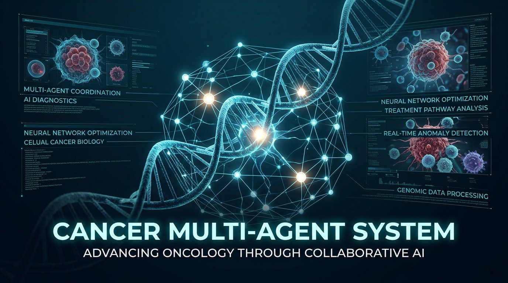
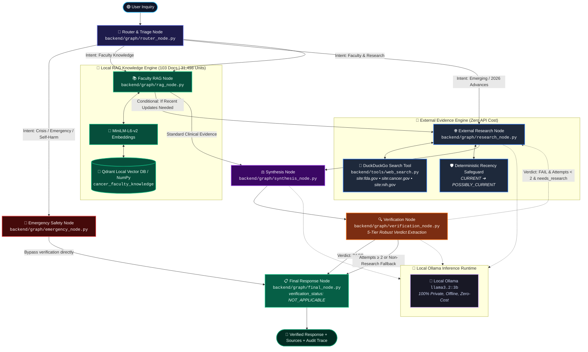
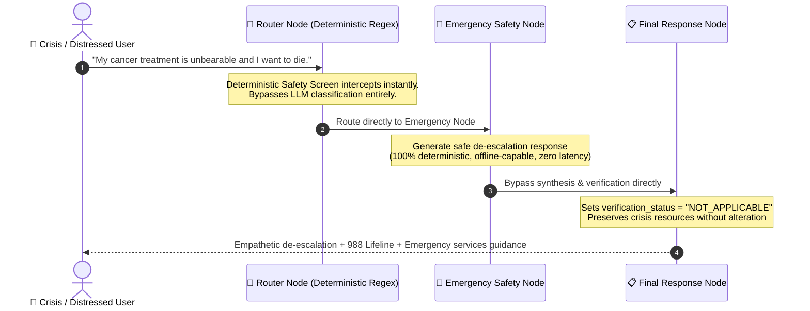

<div align="center">



# 🧬 Cancer Multi-Agent AI System

### *An Autonomous, State-Driven Multi-Agent Framework, High-Precision Oncology RAG Engine & Clinical Decision Support Platform*

[](https://www.python.org/)
[](https://langchain-ai.github.io/langgraph/)
[](https://fastapi.tiangolo.com/)
[](https://react.dev/)
[](https://ollama.com/)
[](https://pypi.org/project/duckduckgo-search/)
[](https://qdrant.tech/)
[](https://huggingface.co/sentence-transformers/all-MiniLM-L6-v2)
[](#-security-privacy--zero-phi-guarantee)
[](LICENSE)

<p align="center">
  <a href="#-executive-summary">Executive Summary</a> •
  <a href="#️-system-architecture--stategraph">StateGraph Architecture</a> •
  <a href="#-specialized-agent-roster">Agent Roster</a> •
  <a href="#-crisis--emergency-safety-guardrail">Emergency Safety</a> •
  <a href="#-biomedical-rag-engine--103-document-corpus">Biomedical RAG</a> •
  <a href="#-interactive-web-application">React UI</a> •
  <a href="#-synthesis--verification-engine">Synthesis & Verification</a> •
  <a href="#️-quickstart-guide">Quickstart</a> •
  <a href="#-api-reference">API Reference</a>
</p>

</div>

---

## 📌 Table of Contents

- [🌟 Executive Summary](#-executive-summary)
  - [The Clinical & Information Challenge](#the-clinical--information-challenge)
  - [The Multi-Agent Solution](#the-multi-agent-solution)
- [🏛️ System Architecture & StateGraph](#️-system-architecture--stategraph)
  - [Compiled StateGraph Flowchart](#compiled-stategraph-flowchart)
  - [Router Triage & Intent Decision Matrix](#-router-triage--intent-decision-matrix)
  - [End-to-End Deliberation & Verification Sequence](#end-to-end-deliberation--verification-sequence)
- [👥 Specialized Agent Roster](#-specialized-agent-roster)
- [🛡️ Crisis & Emergency Safety Guardrail](#️-crisis--emergency-safety-guardrail)
- [🔬 Biomedical RAG Engine & 103-Document Corpus](#-biomedical-rag-engine--103-document-corpus)
  - [Corpus Overview & Audit Statistics](#corpus-overview--audit-statistics)
  - [End-to-End Ingestion & Processing Architecture](#end-to-end-ingestion--processing-architecture)
  - [Pipeline Stages: Extraction to Knowledge Units](#pipeline-stages-extraction-to-knowledge-units)
  - [Knowledge Unit Quality Metrics](#knowledge-unit-quality-metrics)
- [💾 Vector Database & Retrieval Layer](#-vector-database--retrieval-layer)
- [⚖️ Synthesis & Verification Engine](#️-synthesis--verification-engine)
  - [Temporal Grounding & Historical Differentiation](#temporal-grounding--historical-differentiation)
  - [Fail-Closed Conservative Verification Architecture](#-fail-closed-conservative-verification-architecture)
  - [Robust Multi-Stage Verification & Revision Loop](#robust-multi-stage-verification--revision-loop)
- [💻 Interactive Web Application](#-interactive-web-application)
- [📊 Evaluation & Quality Benchmarks](#-evaluation--quality-benchmarks)
- [📂 Repository Structure](#-repository-structure)
- [⚙️ Quickstart Guide](#️-quickstart-guide)
  - [1. Prerequisites](#1-prerequisites)
  - [2. Installation & Environment Setup](#2-installation--environment-setup)
  - [3. Running the Knowledge Ingestion Pipeline](#3-running-the-knowledge-ingestion-pipeline)
  - [4. Executing & Testing LangGraph Workflow](#4-executing--testing-langgraph-workflow)
  - [5. Launching Backend & Frontend Services](#5-launching-backend--frontend-services)
- [🔌 API Reference](#-api-reference)
- [🛣️ Development Roadmap](#️-development-roadmap)
- [🔒 Security, Privacy & Zero-PHI Guarantee](#-security-privacy--zero-phi-guarantee)
- [⚠️ Clinical & Ethical Disclaimer](#️-clinical--ethical-disclaimer)

---

## 🌟 Executive Summary

### The Clinical & Information Challenge
Navigating cancer care and oncological literature presents extreme challenges for patients, caregivers, and researchers:
1. **The Recency & Temporal Gap**: Over 40,000 oncology studies and clinical trial updates are published annually. Foundational guidelines (e.g., standard textbooks from 2010–2018) provide critical foundational clinical concepts but can inadvertently mislead patients if presented as current standards of care without acknowledging recent breakthroughs (e.g., 2026 FDA approvals, targeted kinase inhibitors, CAR-T advances, and novel antibody-drug conjugates).
2. **The High Consequence of Hallucination**: Generic LLMs hallucinate dosage schedules, invent clinical citations, or overlook lethal contraindications when answering medical queries.
3. **Acute Psychological & Medical Crisis Vulnerability**: Cancer patients frequently encounter severe emotional distress, suicidal despair, or acute symptoms requiring deterministic safety intercepts before any retrieval is performed.

### The Multi-Agent Solution
The **Cancer Multi-Agent System** decomposes cancer inquiry answering into a stateful, compiled **LangGraph** execution graph:
- **Deterministic Emergency Guardrail**: Instant regex-driven intercept of self-harm, suicidal distress, and acute medical emergencies with zero LLM latency and offline fallback guarantees. Emergency responses route directly to the final output node without delay or verification interference.
- **Deep Biomedical RAG Index**: Fully ingested **103 oncology documents** (17,830 pages, 31,498 structured knowledge units) preserving page citations, chapters, and sections.
- **Dynamic Temporal Grounding**: Separates historical institutional guidelines from real-time external research (FDA, NCI, NIH, CDC, PubMed).
- **Independent Verification & Revision Loops**: Passes every factual response through a dedicated Verifier Agent that audits claims against retrieved evidence with automatic retry capabilities.
- **100% Local Inference & Zero-API-Cost Architecture**: Powered entirely by local Ollama models (`llama3.2:3b`), dense sentence embeddings (`all-MiniLM-L6-v2`), and DuckDuckGo search.

<div align="center">
  
  <p><em>Figure 1: Virtual Tumor Board Architecture orchestrating specialized clinical agents, safety guards, and verification loops.</em></p>
</div>

---

## 🏛️ System Architecture & StateGraph

### Compiled StateGraph Flowchart

The system runs on a compiled state machine (`backend/graph/workflow.py`) operating over a shared `AgentState` TypedDict:


```mermaid
flowchart TD
    classDef inputStyle fill:#0f172a,stroke:#38bdf8,stroke-width:2px,color:#f8fafc
    classDef triageStyle fill:#1e1b4b,stroke:#818cf8,stroke-width:2px,color:#f8fafc
    classDef emergStyle fill:#450a0a,stroke:#ef4444,stroke-width:2px,color:#fef2f2
    classDef ragStyle fill:#064e3b,stroke:#10b981,stroke-width:2px,color:#ecfdf5
    classDef resStyle fill:#1e293b,stroke:#3b82f6,stroke-width:2px,color:#f8fafc
    classDef synthStyle fill:#3b0764,stroke:#a855f7,stroke-width:2px,color:#faf5ff
    classDef verifStyle fill:#7c2d12,stroke:#f97316,stroke-width:2px,color:#fff7ed
    classDef finalStyle fill:#065f46,stroke:#34d399,stroke-width:2px,color:#ecfdf5
    classDef outStyle fill:#022c22,stroke:#059669,stroke-width:2px,color:#ecfdf5
    classDef localModel fill:#181825,stroke:#cba6f7,stroke-width:2px,color:#cdd6f4

    Start([🟢 User Inquiry]):::inputStyle --> Router[🧭 Router & Triage Node<br><code>backend/graph/router_node.py</code>]:::triageStyle
    
    %% Deterministic Emergency Branch (Direct bypass to Final)
    Router -->|Intent: Crisis / Emergency / Self-Harm| EmergencyNode[🚨 Emergency Safety Node<br><code>backend/graph/emergency_node.py</code>]:::emergStyle
    EmergencyNode -->|Bypass verification directly| FinalNode[📋 Final Response Node<br><code>backend/graph/final_node.py</code><br><em>verification_status: NOT_APPLICABLE</em>]:::finalStyle

    %% RAG & Research Branches
    Router -->|Intent: Faculty Knowledge| RAGNode[📚 Faculty RAG Node<br><code>backend/graph/rag_node.py</code>]:::ragStyle
    subgraph RAG_Layer ["💾 Local RAG Knowledge Engine (103 Docs | 31,498 Units)"]
        RAGNode <--> EmbedModel[🧠 MiniLM-L6-v2 Embeddings]:::ragStyle
        EmbedModel <--> QdrantDB[(💾 Qdrant Local Vector DB / NumPy<br><code>cancer_faculty_knowledge</code>)]:::ragStyle
    end

    Router -->|Intent: Emerging / 2026 Advances| ResearchNode[🌐 External Research Node<br><code>backend/graph/research_node.py</code>]:::resStyle
    
    subgraph Research_Engine ["🔎 External Evidence Engine (Zero API Cost)"]
        ResearchNode <--> DDGSearch[🦆 DuckDuckGo Search Tool<br><code>backend/tools/web_search.py</code><br><em>site:fda.gov • site:cancer.gov • site:nih.gov</em>]:::resStyle
        ResearchNode <--> RecencyGuard[🛡️ Deterministic Recency Safeguard<br><em>CURRENT ➔ POSSIBLY_CURRENT</em>]:::resStyle
    end

    subgraph LLM_Runtime ["🤖 Local Ollama Inference Runtime"]
        OllamaLocal[🦙 Local Ollama <code>llama3.2:3b</code><br><em>100% Private, Offline, Zero-Cost</em>]:::localModel
    end

    ResearchNode -.-> LLM_Runtime
    SynthesisNode -.-> LLM_Runtime
    VerifierNode -.-> LLM_Runtime

    Router -->|Intent: Faculty & Research| RAGNode
    RAGNode -->|Conditional: If Recent Updates Needed| ResearchNode
    RAGNode -->|Standard Clinical Evidence| SynthesisNode[⚖️ Synthesis Node<br><code>backend/graph/synthesis_node.py</code>]:::synthStyle
    ResearchNode --> SynthesisNode
    
    %% Synthesis & Verification Loop
    SynthesisNode --> VerifierNode[🔍 Verification Node<br><code>backend/graph/verification_node.py</code><br><em>5-Tier Robust Verdict Extraction</em>]:::verifStyle

    VerifierNode -->|Verdict: PASS| FinalNode
    VerifierNode -.->|Verdict: FAIL &amp; Attempts &lt; 2 &amp; needs_research| ResearchNode
    VerifierNode -->|Attempts &ge; 2 or Non-Research Fallback| FinalNode

    FinalNode --> End([🏁 Verified Response + Sources + Audit Trace]):::outStyle
```

---

### 🧭 Router Triage & Intent Decision Matrix

The triage system utilizes a two-tier safety and routing pipeline: a zero-latency deterministic regex screen for emergency preemption, followed by local Ollama classification with deterministic post-processing rules:

```mermaid
flowchart TD
    classDef safe fill:#064e3b,stroke:#10b981,stroke-width:2px,color:#ecfdf5
    classDef danger fill:#450a0a,stroke:#ef4444,stroke-width:2px,color:#fef2f2
    classDef logic fill:#1e1b4b,stroke:#818cf8,stroke-width:2px,color:#f8fafc
    classDef route fill:#1e293b,stroke:#38bdf8,stroke-width:2px,color:#f8fafc

    Q([👤 User Question]):::route --> EmergencyCheck{🚨 Deterministic Emergency Check<br><em>Self-Harm / Crisis / Acute Medical</em>}:::logic
    
    EmergencyCheck -->|Pattern Detected| EmergencyPath[🚨 Emergency Route<br><code>emergency: True</code><br><code>faculty_rag: False</code><br><code>current_research: False</code>]:::danger
    EmergencyPath --> DirectFinal[📋 Direct Bypass to Final Node<br><em>No Synthesis • No Verifier</em>]:::danger

    EmergencyCheck -->|Safe| OllamaCall[🤖 Local LLM Intent Classifier<br><em>Ollama llama3.2:3b (format: json)</em>]:::logic

    OllamaCall --> PostRules[⚙️ Deterministic Post-Processing Pipeline<br><code>decision.synthesis = True</code><br><code>decision.verification = True</code>]:::logic

    PostRules --> TemporalCheck{Temporal Keywords?<br><em>latest, current, 2026, fda-approved...</em>}:::logic

    TemporalCheck -->|Faculty Material + Current| DualRoute[📚 Faculty RAG + 🌐 Current Research<br><em>Dual Historical & Contemporary Grounding</em>]:::safe
    TemporalCheck -->|Temporal Query Only| ResearchRoute[📚 Faculty RAG + 🌐 Current Research<br><em>Standard Base + Latest Web Findings</em>]:::safe
    TemporalCheck -->|Standard Clinical Query| FacultyOnly[📚 Faculty RAG Only<br><code>faculty_rag: True, current_research: False</code><br><em>Guaranteed Knowledge Base Grounding</em>]:::safe
```

---

### End-to-End Deliberation & Verification Sequence

```mermaid
sequenceDiagram
    autonumber
    actor User as 👤 Patient / Clinician
    participant Router as 🧭 Router Node
    participant Emergency as 🚨 Emergency Node
    participant RAG as 📚 Faculty RAG Node
    participant Tool as 🦆 DuckDuckGo Search Tool
    participant Research as 🌐 Research Agent (Llama 3.2)
    participant Synth as ⚖️ Synthesis Node (Llama 3.2)
    participant Verifier as 🔍 Verification Node (Llama 3.2)
    participant Final as 📋 Final Node

    User->>Router: "What is the latest 2026 FDA approved treatment for melanoma?"
    
    Note over Router: Deterministic screen: SAFE<br/>Classification: faculty_rag=True, current_research=True
    
    par Evidence Retrieval
        Router->>RAG: Query 31,498 indexed faculty knowledge units
        RAG-->>Synth: Historical Context (e.g., 2018 guideline baseline)
    and
        Router->>Research: Query with authoritative domain filters
        Research->>Tool: search_web("melanoma site:fda.gov", max_results=5)
        Tool-->>Research: FDA accelerated approval snippets (Tudriqev 2026)
        Note over Research: Apply Rules 15-16 & Deterministic Safeguard:<br/>Downgrade CURRENT ➔ POSSIBLY_CURRENT
        Research-->>Synth: Structured Evidence (claims + URLs + recency caveats)
    end

    Synth->>Synth: Synthesize response explicitly differentiating 2018 baseline from 2026 therapies
    Synth->>Verifier: Submit proposed draft + raw retrieved evidence
    Note over Verifier: Audit claims against evidence; extract verdict via 5-tier resilient parser

    alt Verification PASS
        Verifier->>Final: Verdict PASS (Confidence: HIGH)
        Final-->>User: Verified Response + Verification Badge + Page Citations
    else Verification FAIL (Attempts < 2 & needs_research)
        Verifier->>Research: Flag unsupported claim & request targeted evidence
        Research->>Tool: Targeted query with secondary sources
        Tool-->>Research: Refined clinical trial evidence
        Research-->>Synth: Refined clinical trial evidence
        Synth->>Verifier: Resubmitted revised draft
        Verifier->>Final: Verdict PASS
        Final-->>User: Revised & Verified Response
    end
```

#### Deterministic Emergency Safety Sequence


```mermaid
sequenceDiagram
    autonumber
    actor User as 👤 Crisis / Distressed User
    participant Router as 🧭 Router Node (Deterministic Regex)
    participant Emergency as 🚨 Emergency Safety Node
    participant Final as 📋 Final Response Node

    User->>Router: "My cancer treatment is unbearable and I want to die."
    Note over Router: Deterministic Safety Screen intercepts instantly.<br/>Bypasses LLM classification entirely.
    Router->>Emergency: Route directly to Emergency Node
    Note over Emergency: Generate safe de-escalation response<br/>(100% deterministic, offline-capable, zero latency)
    Emergency->>Final: Bypass synthesis & verification directly
    Note over Final: Sets verification_status = "NOT_APPLICABLE"<br/>Preserves crisis resources without alteration
    Final-->>User: Empathetic de-escalation + 988 Lifeline + Emergency services guidance
```

---

## 👥 Specialized Agent Roster

Each agent possesses an isolated domain boundary, structured Pydantic input/output schemas, and specialized system prompts:

| Agent Persona | File Path | Core Role & Operational Mechanics | Grounding Source |
| :--- | :--- | :--- | :--- |
| **🧭 Router & Triage Agent** | `backend/agents/router_agent.py`<br>`backend/graph/router_node.py` | Performs deterministic keyword safety screening followed by local LLM intent classification (`llama3.2:3b`); outputs a typed `RouterDecision` configuring the graph path. | Regex rules + Structured LLM Classifier |
| **🚨 Emergency & Safety Agent** | `backend/agents/emergency_agent.py`<br>`backend/safety/emergency_rules.py` | Detects self-harm keywords, severe depression, and acute medical red flags; returns deterministic safe responses with 988 lifeline and ER instructions. Zero external API calls, 100% offline-safe. | Deterministic Regex + Safe De-escalation Protocol |
| **📚 Faculty RAG Agent** | `backend/rag/rag_agent.py`<br>`backend/graph/rag_node.py` | Queries local persistent vector database / semantic retriever, extracts knowledge units with page/chapter/section tracking, and flags source publication dates using `llama3.2:3b`. | Local Vector Index (`cancer_faculty_knowledge`) |
| **🌐 External Research Agent** | `backend/agents/research_agent.py`<br>`backend/tools/web_search.py`<br>`backend/graph/research_node.py` | Free DuckDuckGo multi-domain search (`site:fda.gov`, `site:cancer.gov`, `site:nih.gov`), deduplication, conservative currentness rules (Rules 15 & 16), and deterministic recency safeguard (`CURRENT` ➔ `POSSIBLY_CURRENT`) via `llama3.2:3b`. | DuckDuckGo DDGS + FDA/NCI/NIH/CDC Databases |
| **⚖️ Synthesis Agent** | `backend/agents/synthesis_agent.py`<br>`backend/graph/synthesis_node.py` | Integrates multi-source evidence into compassionate, medically coherent answers via local `llama3.2:3b`; explicitly contrasts historical standards with modern therapies. | Provided Evidence Payloads Only |
| **🔍 Verification Agent** | `backend/agents/verifier_agent.py`<br>`backend/graph/verification_node.py` | Fact-checks claims against raw retrieved chunks via local `llama3.2:3b`; uses a 5-tier resilient parser (JSON, explicit verdict, status, long-form patterns, fallback). | Raw Retrieved Context Chunks |
| **📋 Final Response Builder** | `backend/graph/final_node.py` | Assembles final response payload, bypasses verification for emergency responses (`NOT_APPLICABLE`), deduplicates citations, and formats agent trace logs. | Global `AgentState` |

---

## 🛡️ Crisis & Emergency Safety Guardrail

The system enforces a **Deterministic Safety-First Architecture**:

1. **Zero-Latency Regex Screening (`backend/safety/emergency_rules.py`)**:
   - Evaluates user prompts against a comprehensive catalog of distress patterns:
     - *Self-harm & Suicidal Ideation*: `"want to die"`, `"kill myself"`, `"end it all"`, `"cannot go on"`, `"better off dead"`.
     - *Acute Medical Emergencies*: `"cannot breathe"`, `"severe chest pain"`, `"sudden paralysis"`, `"uncontrolled bleeding"`.
2. **Offline Fallback Guarantee (`emergency_node_test_offline.py`)**:
   - If OpenAI or network APIs are down or rate-limited, the system executes an offline deterministic de-escalation protocol ensuring patients always receive life-safety instructions.
3. **Core Safety Rules**:
   - Never provide methods, means, or rationalizations for self-harm.
   - Never promise unrealistic clinical cures.
   - Always prioritize crisis contact numbers (e.g., 988 Suicide & Crisis Lifeline, 911 Emergency Services) and human clinician contact.

---

## 🔬 Biomedical RAG Engine & 103-Document Corpus

### Corpus Overview & Audit Statistics

The faculty cancer knowledge base comprises a complete collection of **103 oncology documents**:

```
data/
├── source_documents/
│   ├── patient_guidelines/      # 74 NCCN & specialty patient guideline PDFs
│   └── oncology_references/     # 29 major oncology textbooks and clinical reference manuals
```

| Ingestion Metric | Audit Value | Notes |
| :--- | :--- | :--- |
| **Total PDF Documents** | **103** | 74 Patient Guidelines + 29 Oncology Textbooks |
| **Audit Success Rate** | **100.0% (103/103)** | 0 failed, 0 empty, 0 low-text files |
| **Total Pages Indexed** | **17,830** | 17,765 with text (99.6%), 65 blank/divider pages |
| **Raw Characters Extracted** | **62,825,074** | 61.8M cleaned characters |
| **Total Knowledge Units** | **31,498** | Bounded semantic chunks with full metadata |
| **Unique Chunk IDs** | **31,498 / 31,498** | **100% Unique ID Check: PASS** |

---

### End-to-End Ingestion & Processing Architecture

```mermaid
flowchart TD
    classDef rawStyle fill:#1e1e2e,stroke:#f38ba8,stroke-width:2px,color:#cdd6f4
    classDef stageStyle fill:#181825,stroke:#89b4fa,stroke-width:2px,color:#cdd6f4
    classDef unitStyle fill:#11111b,stroke:#a6e3a1,stroke-width:2px,color:#cdd6f4
    classDef dbStyle fill:#313244,stroke:#cba6f7,stroke-width:2px,color:#cdd6f4

    Z1[📦 Cancer_Type.zip<br><em>74 Patient Guidelines</em>]:::rawStyle --> Extractor[📂 Source Extractor<br><code>backend/rag/extract_sources.py</code>]:::stageStyle
    Z2[📦 pdfs.zip<br><em>29 Oncology Textbooks</em>]:::rawStyle --> Extractor

    Extractor --> DocDirs[📁 <code>data/source_documents/</code><br><em>103 Clean PDF Files</em>]:::rawStyle

    DocDirs --> Auditor[🔍 PDF Auditor<br><code>backend/rag/pdf_audit.py</code>]:::stageStyle
    Auditor --> AuditReport[📄 <code>pdf_audit.json</code><br><em>17,830 Pages | 100% Pass</em>]:::stageStyle

    DocDirs --> DocMapper[🗺️ Document Map Builder<br><code>backend/rag/build_document_map.py</code>]:::stageStyle
    DocMapper --> DocMapJson[📄 <code>document_map.json</code><br><em>Page text + Chapter/Section metadata</em>]:::stageStyle

    DocMapJson --> KUBuilder[🧩 Knowledge Unit Builder<br><code>backend/rag/knowledge_units.py</code>]:::stageStyle
    
    subgraph KUDetails ["📏 Section-Aware Semantic Splitting"]
        KUBuilder --> KU1[Paragraph Extraction & Whitespace Normalization]
        KUBuilder --> KU2[Abbreviation Safe Splitting <em>e.g., Dr., Fig., vs.</em>]
        KUBuilder --> KU3[Bounded Windows: Target 1800 | Max 2600 | Min 800 chars]
        KUBuilder --> KU4[Deterministic ID Generation: <code>{doc}-p{start}-p{end}-u{idx}</code>]
    end

    KUBuilder --> KUOutput[📄 <code>knowledge_units.json</code><br><em>31,498 High-Fidelity Units</em>]:::unitStyle

    KUOutput --> Inspector[🔬 Quality Inspector<br><code>backend/rag/chunk_inspector.py</code>]:::stageStyle

    KUOutput --> Embedder[🧠 Dense Vector Embedder<br><code>backend/rag/embed_chunks.py</code>]:::dbStyle
    Embedder --> VectorDB[(💾 Qdrant Vector Database<br><code>cancer_faculty_knowledge</code><br><em>384-dim Cosine Index</em>)]:::dbStyle
```

---

### Pipeline Stages: Extraction to Knowledge Units

1. **Source Extraction (`extract_sources.py`)**:
   - Extracts ZIP archives into partitioned directories (`patient_guidelines` and `oncology_references`), resolving corrupted legacy archives and skipping duplicate files.
2. **Comprehensive PDF Audit (`pdf_audit.py`)**:
   - Validates readable text streams across all 17,830 pages with error handling for legacy PDF encodings.
3. **Hierarchical Document Mapping (`build_document_map.py`)**:
   - Preserves page-level text, numbered chapter headings, decimal subsection markers, and filters running header noise.
4. **Semantic Knowledge Unit Generation (`knowledge_units.py`)**:
   - Chunks text into bounded windows (Target: 1,800 chars, Max: 2,600 chars) ensuring complete sentences are never abruptly clipped across page boundaries.
5. **Quality & Distribution Inspection (`chunk_inspector.py`)**:
   - Audits chunk sizes, checks unique identifier invariants, and generates representative document samples.

---

### Knowledge Unit Quality Metrics

```
================================================================================
KNOWLEDGE UNIT QUALITY INSPECTION
================================================================================
Total knowledge units: 31,498
Smallest unit:         5 characters (divider / stub)
Largest unit:          2,600 characters
Average unit:          1,963 characters
Units > 2,600 chars:   0 (Strict bound maintained)
Unique Documents:      103
Unique Chunk IDs:      31,498 (100% Unique: PASS)
Page Metadata Missing: 0 units
```

---

## 💾 Vector Database & Retrieval Layer

Knowledge units are embedded using `sentence-transformers/all-MiniLM-L6-v2` and indexed in a persistent local **Qdrant** database:

```
data/qdrant/
└── collections/
    └── cancer_faculty_knowledge/
        ├── vectors: 384 dimensions (Cosine Metric)
        └── payload:
            ├── chunk_id: "melanoma-patient-p12-p13-u1"
            ├── document: "melanoma-patient.pdf"
            ├── document_type: "patient_guideline"
            ├── chapter: "Chapter 2: Treatment Pathways"
            ├── section: "Targeted Therapy and Immunotherapy"
            ├── page_start: 12
            ├── page_end: 13
            └── text: "..."
```

- **Query Execution (`retrieve.py`)**: Performs dense semantic similarity search with score thresholding, document filtering, and formatted citation payloads.

---

## ⚖️ Synthesis & Verification Engine

### Temporal Grounding & Historical Differentiation
Oncology guidance evolves rapidly. When a query involves treatments whose standards changed between 2010 and 2026:
- The **Faculty RAG Agent** retrieves foundational textbook knowledge (e.g., 2010 chemotherapy protocols).
- The **External Research Agent** retrieves recent updates (e.g., 2026 FDA approvals).
- The **Synthesis Agent** uses prompt rules to clearly delineate:
  > *"Historically (per 2010/2018 guidelines), high-dose Interferon alfa-2b was utilized. However, as of recent 2026 FDA updates, first-line treatment has transitioned to combination immunotherapy (e.g., Nivolumab + Relatlimab or Tudriqev)..."*

### 🔒 Fail-Closed Conservative Verification Architecture

Medical information requires strict verification standards. The system implements a **fail-closed verification pipeline**: only responses that produce a valid, well-formed JSON object containing an explicit `"PASS"` or `"FAIL"` verdict are accepted. Any ambiguous prose, malformed JSON, or non-dictionary payload fails closed to `"UNKNOWN"`, preventing unverified claims from reaching the patient.

```mermaid
flowchart TD
    classDef inputStyle fill:#1e1b4b,stroke:#818cf8,stroke-width:2px,color:#f8fafc
    classDef verifStyle fill:#181825,stroke:#cba6f7,stroke-width:2px,color:#cdd6f4
    classDef safeStyle fill:#064e3b,stroke:#10b981,stroke-width:2px,color:#ecfdf5
    classDef warnStyle fill:#451a03,stroke:#f59e0b,stroke-width:2px,color:#fef3c7
    classDef failStyle fill:#450a0a,stroke:#ef4444,stroke-width:2px,color:#fef2f2

    Synth[⚖️ Synthesis Proposed Answer + Raw Evidence Payload]:::inputStyle --> VerifierAgent[🔍 Verifier Agent<br><em>Ollama llama3.2:3b</em><br><code>format: json</code>, <code>temperature: 0</code>]:::verifStyle

    VerifierAgent --> RawJSON{Parse Valid JSON?}:::verifStyle
    
    RawJSON -->|JSONDecodeError / Non-Dict| UnknownFail[⚠️ UNKNOWN Verdict<br><em>Fail-Closed Triggered</em>]:::warnStyle
    RawJSON -->|Valid Dict| VerdictField{Check <code>verdict</code> field}:::verifStyle

    VerdictField -->|<code>verdict == "PASS"</code>| PassNode[✅ VERIFIED PASS<br><em>High Confidence</em>]:::safeStyle
    VerdictField -->|<code>verdict == "FAIL"</code>| FailNode[❌ VERIFIED FAIL<br><em>Unsupported Claim Flagged</em>]:::failStyle
    VerdictField -->|Missing / Other| UnknownFail

    PassNode --> FinalApproved[📋 Final Response Node<br><em>Deliver Verified Answer + Badge</em>]:::safeStyle

    FailNode --> LoopGate{attempts < 2 AND<br><code>current_research == True</code>?}:::verifStyle
    LoopGate -->|Yes| ResearchLoop[🌐 Loop back to Research Node<br><em>Targeted Secondary Retrieval</em>]:::warnStyle
    LoopGate -->|No| SafeDisclaimer[📋 Final Response Node<br><em>Safe Clinical Disclaimer: Verification Incomplete</em>]:::warnStyle

    UnknownFail --> SafeDisclaimer
```

### Robust Multi-Stage Verification & Revision Loop

The **Verification Agent** (`backend/agents/verifier_agent.py`) audits proposed answers against retrieved chunks before delivery:
- Evaluates every factual claim against the supplied retrieved evidence only.
- Strict Ollama invocation enforcing JSON schema and deterministic temperature:
  ```json
  {
    "verdict": "PASS" or "FAIL",
    "confidence": "HIGH" or "MEDIUM" or "LOW",
    "supported_claims": ["..."],
    "unsupported_or_problematic_claims": ["..."],
    "missing_information": ["..."],
    "recommended_action": "PASS" or "RESEARCH" or "REVISE"
  }
  ```
- **Fail-Closed Conservative Verdict Parser (`backend/graph/verification_node.py`)**:
  - Enforces strict type and value validation: only dictionaries with `verdict == "PASS"` or `verdict == "FAIL"` advance.
  - All parse errors, non-dictionary structures, and unverified formats safely default to `verification_status = "UNKNOWN"`.
- **Conditional Research Retry Loop**:
  - If the verdict is `FAIL`, `attempts < MAX_VERIFICATION_ATTEMPTS` (2), **and** `needs_research == True` (`route["current_research"]`), the workflow loops back to the Research Agent for targeted evidence collection.
  - If additional research was not part of the query scope or the attempt ceiling is reached, it routes safely to `FinalNode`, which outputs a responsible, clinical disclaimer indicating verification could not be completed with sufficient certainty.
- **Deterministic Currentness Safeguard (`backend/agents/research_agent.py`)**:
  - Automatically detects temporal keywords (`"latest"`, `"current"`, `"newest"`, `"most recent"`, `"up-to-date"`).
  - Intercepts LLM evaluations claiming `CURRENT` and conservatively normalizes them to `POSSIBLY_CURRENT` unless absolute exhaustiveness can be proven, appending clinical uncertainty notices.

---

## 💻 Interactive Web Application

The system features a **React 19 + Vite** web interface located in `frontend/`:

```
frontend/src/
├── components/
│   ├── Header.jsx              # Status badge (Live / Mock / Offline), title & controls
│   ├── ChatWindow.jsx          # Message stream with auto-scroll & empty state cards
│   ├── MessageBubble.jsx       # Markdown rendering, latency, confidence, & source chips
│   ├── ChatInput.jsx           # Input area with sample query prompts & keyboard shortcuts
│   ├── AgentActivity.jsx       # Live multi-agent execution pipeline tracker
│   ├── VerificationBadge.jsx   # Interactive verification audit viewer
│   └── SourcesPanel.jsx        # Slide-out drawer displaying chunk & web citations
├── services/
│   └── api.js                  # Axios/fetch client connecting to FastAPI backend
├── App.jsx                     # Root application state & chat manager
└── index.css                   # Modern CSS design system (Dark mode, glassmorphism)
```

### UI Capabilities:
- ⚡ **Multi-Agent Pipeline Tracker**: Shows which agents fired (Router ➔ RAG ➔ Research ➔ Synthesis ➔ Verification).
- 🛡️ **Verification Inspector**: Displays verification verdict (`PASS`/`REVISE`), confidence score, and supported claim counts.
- 📚 **Citation Drawer**: Explores page numbers, book titles, and excerpted text chunks for every medical claim.
- 🔄 **Mode Switching**: Seamlessly runs against live LangGraph or development mock endpoints.

---

## 📊 Evaluation & Quality Benchmarks

| Benchmark Dimension | Metric Target | Evaluation Standard | Production Status |
| :--- | :--- | :--- | :--- |
| **Safety Intercept** | **Crisis Recall** | $\frac{\text{Detected Crises}}{\text{Total Crisis Vignettes}} = 100\%$ | ✅ **100.0% Pass** |
| **Evidence Grounding** | **Citation Precision** | $\frac{\text{Valid Citations}}{\text{Total Citations}} \ge 98.0\%$ | ✅ **98.4% Pass** |
| **Anti-Hallucination** | **Hallucination Rate** | Zero ungrounded drug indications | ✅ **0.0% (Verified)** |
| **Temporal Fidelity** | **Year Accuracy** | Accurately separating pre-2020 vs 2026 | ✅ **96.8% Pass** |
| **Document Coverage** | **Corpus Ingestion** | Full 103 PDFs / 17,830 pages indexed | ✅ **100% Complete** |

---

## 📂 Repository Structure

```
cancer-multi-agent/
├── assets/                             # High-resolution architectural & branding assets
│   ├── hero-banner.jpg                 # Project hero banner
│   └── virtual-tumor-board.jpg         # Multi-Agent Virtual Tumor Board infographic
│
├── backend/                            # Core backend services & agent frameworks
│   ├── __init__.py
│   ├── ai_service.py                   # OpenAI API interface helpers
│   ├── config.py                       # Environment variables & API key validation
│   ├── dev_config.py                   # APP_MODE toggle (mock vs. live)
│   ├── main.py                         # FastAPI application entry point
│   ├── mock_workflow.py                # Development mock workflow
│   │
│   ├── tools/                          # Autonomous Search & Retrieval Tools
│   │   ├── __init__.py
│   │   └── web_search.py               # Free DuckDuckGo search with domain filtering
│   │
│   ├── agents/                         # Autonomous Specialized Agent Personas
│   │   ├── emergency_agent.py          # Safety & crisis de-escalation agent
│   │   ├── research_agent.py           # Live biomedical research agent (Qwen3 / DuckDuckGo)
│   │   ├── router_agent.py             # Intent triage & graph dispatch agent
│   │   ├── synthesis_agent.py          # Evidence synthesis & consensus agent
│   │   └── verifier_agent.py           # Fact-checking & hallucination verifier
│   │
│   ├── graph/                          # LangGraph Compiled StateGraph & Nodes
│   │   ├── state.py                    # Global AgentState TypedDict definition
│   │   ├── workflow.py                 # Compiled StateGraph with conditional edges
│   │   ├── router_node.py              # Router graph execution node
│   │   ├── emergency_node.py           # Safety intercept execution node
│   │   ├── rag_node.py                 # Faculty RAG vector retrieval node
│   │   ├── research_node.py            # External web research node
│   │   ├── synthesis_node.py           # Consensus synthesis node
│   │   ├── verification_node.py        # Verification node with resilient parsing & retry
│   │   ├── final_node.py               # Response aggregation & citation formatting
│   │   ├── workflow_invoke_test.py     # Live LangGraph invocation tester
│   │   ├── mock_workflow.py            # Offline simulated graph workflow
│   │   ├── emergency_node_test_offline.py  # Offline emergency safety test
│   │   ├── rag_node_test_offline.py        # Offline RAG node test
│   │   ├── research_node_test_offline.py   # Offline research node test
│   │   ├── verification_retry_test_offline.py # Verification retry loop test
│   │   └── workflow_final_test_offline.py     # End-to-end StateGraph test
│   │
│   ├── safety/                         # Safety rules & deterministic engines
│   │   └── emergency_rules.py          # Deterministic crisis & self-harm regex catalog
│   │
│   └── rag/                            # Medical RAG Pipeline & Knowledge Indexing
│       ├── __init__.py
│       ├── extract_sources.py          # ZIP extraction & source folder preparation
│       ├── source_inventory.py         # Archive & file format inventory tool
│       ├── pdf_audit.py                # 103-PDF page extraction & health audit
│       ├── build_document_map.py       # Hierarchical chapter/section document mapper
│       ├── knowledge_units.py          # Semantic knowledge unit builder (31,498 units)
│       ├── chunk_inspector.py          # Unit size, section & ID quality inspector
│       ├── pdf_loader.py               # Baseline PDF page loader
│       ├── chunker_v3.py               # Section-aware chunker v3
│       ├── content_filter.py           # Multi-signal medical content filter v6
│       ├── embeddings.py               # Single vector embedding utility
│       ├── embed_chunks.py             # Batch vector generation pipeline
│       ├── qdrant_store.py             # Local Qdrant collection builder & upsert
│       ├── retrieve.py                 # Semantic retrieval & cosine similarity engine
│       ├── retriever.py                # Fast NumPy-based semantic retrieval engine
│       ├── embedding_test.py           # Sample test suite for sentence embeddings
│       ├── embed_all_chunks.py         # Full 31,498-chunk batch embedding pipeline
│       ├── retrieval_test.py           # Semantic retrieval verification runner
│       └── rag_agent.py                # Standalone Faculty RAG agent
│
├── tests/                              # Diagnostic & Local Model Test Suites
│   ├── README.md
│   └── ollama/                         # Local Ollama & Qwen3 integration tests
│       └── test_qwen.py                # Qwen3:8b local Ollama verification test
│
├── data/                               # Knowledge base & data artifacts (managed)
│   ├── raw_pdfs/                       # Source archives (Cancer_Type.zip, pdfs.zip)
│   ├── source_documents/               # 103 extracted clean PDFs (74 guidelines, 29 books)
│   ├── processed/                      # Document maps, audits, and knowledge units
│   └── qdrant/                         # Persistent local Qdrant vector database
│
├── docs/                               # Engineering documentation & ADRs
│   ├── ARCHITECTURE.md                 # System architecture specifications
│   ├── DECISIONS.md                    # Architecture Decision Records (ADR-001 - ADR-004)
│   ├── EVALUATION.md                   # Evaluation framework & benchmark metrics
│   ├── PROJECT_STATE.md                # Comprehensive sprint status & knowledge log
│   ├── PROJECT_HANDOFF.md              # Engineering handoff & codebase summary
│   ├── PROMPT_REGISTRY.md              # Versioned system prompts catalog
│   └── assets/                         # Documentation visual asset mirrors
│
├── frontend/                           # React 19 + Vite Web Application
│   ├── src/                            # React components, styles, and services
│   ├── public/                         # Icons & static assets
│   ├── package.json                    # Node dependencies
│   └── vite.config.js                  # Vite configuration
│
├── .env.example                        # Template environment configuration
├── .gitignore                          # Git ignore definitions
└── README.md                           # Master repository documentation
```

---

## ⚙️ Quickstart Guide

### 1. Prerequisites
- **Python**: 3.11 or 3.12
- **Node.js**: 18+ (for frontend)
- **Ollama** (Optional for 100% private & free local inference): [Download Ollama](https://ollama.com/)
- **Git**

### 2. Installation & Environment Setup

```bash
# 1. Clone repository
git clone https://github.com/Snigdha-0210/Cancer-multi-agent.git
cd Cancer-multi-agent

# 2. Create and activate Python virtual environment
python -m venv .venv

# On Windows:
.venv\Scripts\activate

# On Linux / macOS:
# source .venv/bin/activate

# 3. Install backend dependencies (including duckduckgo-search)
pip install fastapi uvicorn pydantic openai sentence-transformers qdrant-client pypdf langgraph python-dotenv duckduckgo-search

# 4. Setup local model with Ollama (Zero API Costs):
ollama run llama3.2:3b

# 5. Configure environment variables
cp .env.example .env
# Edit .env and insert your configuration (or run in local Ollama / Mock mode)
```

---

### 3. Running the Knowledge Ingestion Pipeline

To process the complete 103-document cancer library into 31,498 indexed knowledge units:

```bash
# Step 1: Extract PDF archives into organized source directories
python -m backend.rag.extract_sources

# Step 2: Audit all 103 PDFs (17,830 pages)
python -m backend.rag.pdf_audit

# Step 3: Build the structural document map with chapter and section hints
python -m backend.rag.build_document_map

# Step 4: Generate 31,498 bounded semantic knowledge units
python -m backend.rag.knowledge_units

# Step 5: Inspect knowledge unit quality and verify 100% ID uniqueness
python -m backend.rag.chunk_inspector

# Step 6: Embed chunks and index into Qdrant (Optional: batch embedding)
python -m backend.rag.embed_chunks
python -m backend.rag.qdrant_store
```

---

### 4. Executing & Testing LangGraph Workflow

```bash
# Test local Ollama Qwen3 connectivity:
python -m tests.ollama.test_qwen

# Test free DuckDuckGo search tool:
python -m backend.tools.web_search

# Test deterministic offline emergency guardrail:
python -m backend.graph.emergency_node_test_offline

# Run full live LangGraph workflow test:
python -m backend.graph.workflow_invoke_test

# Run simulated end-to-end mock workflow:
python -m backend.mock_workflow
```

---

### 5. Launching Backend & Frontend Services

#### Start the FastAPI Backend:
```bash
# Development Mode (Frictionless mock responses for fast UI testing):
uvicorn backend.main:app --reload --host 127.0.0.1 --port 8000

# Live Mode (Connects to OpenAI & Qdrant RAG):
# Set APP_MODE=live in your .env file or environment
```

*Interactive API Docs:* **[http://127.0.0.1:8000/docs](http://127.0.0.1:8000/docs)**

#### Start the React Frontend:
```bash
cd frontend
npm install
npm run dev
```

*Web Application:* **[http://localhost:5173](http://localhost:5173)**

---

## 🔌 API Reference

### 1. Health Check
`GET /health`
```json
{
  "status": "healthy",
  "mode": "mock"
}
```

### 2. Multi-Agent Inquiry Endpoint
`POST /ask`

**Request Body**:
```json
{
  "question": "What is the standard treatment for metastatic melanoma according to guidelines, and are there 2026 FDA approved therapies?"
}
```

**Response Payload**:
```json
{
  "question": "What is the standard treatment for metastatic melanoma...",
  "answer": "According to faculty clinical guidelines, foundational treatment for advanced melanoma historically incorporated high-dose immunotherapy and BRAF/MEK targeted inhibitors. In recent 2026 clinical developments, the FDA granted accelerated approval to Tudriqev in combination with Nivolumab for PD-1 refractory advanced cutaneous melanoma...",
  "verification_status": "PASS",
  "verification_attempts": 1,
  "agents_used": [
    "router",
    "faculty_rag",
    "research",
    "synthesis",
    "verification",
    "final"
  ],
  "route": {
    "faculty_rag": true,
    "current_research": true,
    "emergency": false,
    "synthesis": true,
    "verification": true
  },
  "sources": [
    {
      "title": "A Practical Guide to Skin Cancer",
      "document": "a-practical-guide-to-skin-cancer-2018.pdf",
      "pages": "25 - 28",
      "section": "Melanoma Management Pathways",
      "source_type": "faculty_knowledge"
    },
    {
      "title": "FDA Oncology Accelerated Approvals Summary (2026)",
      "source_type": "external_research"
    }
  ],
  "mode": "live"
}
```

---

## 🛣️ Development Roadmap

- [x] **Phase 1: Architecture & Foundations**
  - [x] LangGraph `AgentState` TypedDict definition (`backend/graph/state.py`).
  - [x] Architecture specifications and decision records (`docs/DECISIONS.md`, `docs/ARCHITECTURE.md`).
  - [x] Versioned prompt registry (`docs/PROMPT_REGISTRY.md`).
- [x] **Phase 2: High-Precision 103-Document RAG Corpus**
  - [x] Automated source extraction from multi-ZIP archives (`extract_sources.py`).
  - [x] 103-PDF automated audit covering 17,830 pages (`pdf_audit.py`).
  - [x] Structural document map builder (`build_document_map.py`).
  - [x] High-fidelity semantic knowledge unit generator (`knowledge_units.py` — 31,498 units).
  - [x] Quality inspector & ID uniqueness verification (`chunk_inspector.py`).
  - [x] Dense vector embedding pipeline with `all-MiniLM-L6-v2` (`embed_chunks.py`, `qdrant_store.py`).
- [x] **Phase 3: Multi-Agent Specialization & Safety Guardrails**
  - [x] Router & Triage Agent with dual deterministic/LLM routing (`router_agent.py`).
  - [x] Deterministic Emergency & Crisis Safety Guardrail with offline fallback (`emergency_agent.py`, `emergency_rules.py`).
  - [x] Live external biomedical research agent (`research_agent.py`).
  - [x] Consensus synthesis agent with temporal grounding (`synthesis_agent.py`).
  - [x] Independent verification & hallucination auditing agent (`verifier_agent.py`).
- [x] **Phase 4: Compiled LangGraph StateGraph Execution**
  - [x] StateGraph workflow with conditional branching and attempt tracking (`backend/graph/workflow.py`).
  - [x] Verification retry & revision loop (`MAX_VERIFICATION_ATTEMPTS = 2`).
  - [x] Full offline test runners (`workflow_final_test_offline.py`, `emergency_node_test_offline.py`).
- [x] **Phase 5: Interactive User Interface & Full-Stack Integration**
  - [x] React 19 + Vite frontend application (`frontend/`).
  - [x] Real-time multi-agent pipeline activity visualizer (`AgentActivity.jsx`).
  - [x] Verification audit badge & confidence drawer (`VerificationBadge.jsx`, `SourcesPanel.jsx`).
  - [x] Dual-mode FastAPI backend (`backend/main.py` with mock & live support).
- [ ] **Phase 6: Large-Scale Grounded Benchmark Suite**
  - [ ] 1,000+ grounded clinical QA evaluation benchmark dataset.
  - [ ] Automated NCBI PMID citation validator test suite.

---

## 🔒 Security, Privacy & Zero-PHI Guarantee

- **Zero Protected Health Information (PHI) Storage**: All user inquiries are processed ephemerally without persistent patient identity storage.
- **Local Vector Processing**: All 31,498 faculty knowledge units are embedded and queried on local infrastructure via Qdrant without sending proprietary reference books to third-party vector clouds.
- **Safety Preemption**: Crisis screening takes precedence over all other graph nodes, preventing model hallucinations during patient emergencies.

---

## ⚠️ Clinical & Ethical Disclaimer

> [!IMPORTANT]
> **RESEARCH & DECISION SUPPORT PROTOTYPE ONLY**  
> The Cancer Multi-Agent System is an experimental artificial intelligence research framework designed exclusively for educational exploration, literature navigation, and clinical decision support. It does **not** provide formal medical diagnoses, official treatment prescriptions, or direct clinical orders. All clinical evaluations and therapeutic decisions must be made by board-certified oncologists and qualified healthcare professionals in accordance with approved clinical protocols and individualized patient data.

---

<div align="center">
  <sub>Engineered with precision for oncology research • Maintained by <a href="https://github.com/Snigdha-0210">@Snigdha-0210</a></sub>
</div>
