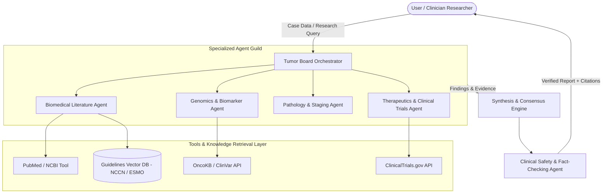

# 🏗️ Architecture Design

## 🌟 System Overview
The **Cancer Multi-Agent System** is structured as an asynchronous, collaborative network of specialized AI agents coordinated by an Orchestrator (Tumor Board Coordinator). Each agent encapsulates domain-specific knowledge, tools, and reasoning strategies.

---

## 🏛️ High-Level Multi-Agent Architecture

---

## 👥 Agent Roster & Roles

| Agent | Role & Responsibility | Core Tools & Inputs |
| :--- | :--- | :--- |
| **Orchestrator (Chief Coordinator)** | Analyzes input query/case, decomposes tasks, delegates to specialists, aggregates findings. | Task graph planner, consensus engine. |
| **Literature Research Agent** | Synthesizes current peer-reviewed research, medical journals, and clinical trials. | PubMed API, Semantic Scholar API, PubMed Central (PMC). |
| **Genomics & Biomarker Agent** | Interprets somatic/germline mutations, MSI/TMB status, targeted therapy sensitivity/resistance. | OncoKB API, ClinVar, CIViC database. |
| **Pathology & Staging Agent** | Evaluates histological findings, TNM staging, grading, and immunohistochemistry (IHC) panels. | AJCC staging guide, Pathology RAG index. |
| **Therapeutics & Trial Matcher** | Recommends evidence-based treatment regimens, lines of therapy, and active clinical trials. | ClinicalTrials.gov API, NCCN Guidelines vector store. |
| **Safety & Verification Agent** | Validates factual claims, checks drug-drug interactions, flags contraindications, and verifies citation links. | Citation validator, Hallucination checker. |

---

## 🔄 Execution & Data Flow
1. **Intake & Decomposition**: The Orchestrator receives clinical case details or research queries, parsing structured data (demographics, stage, biomarkers) and unstructured notes.
2. **Parallel Dispatch**: Tasks are dispatched asynchronously to appropriate specialized agents.
3. **Retrieval & Evidence Grounding**: Agents utilize toolchains to query vector databases, APIs, and clinical literature.
4. **Synthesis & Deliberation**: If conflicting findings emerge, a cross-agent debate round occurs to reach structured consensus.
5. **Safety & Verification**: The safety guardrail checks every recommendation against verified clinical guidelines and validates PMID references.
6. **Final Structured Output**: Comprehensive tumor board summary with clear evidence levels (e.g., Level 1A, 2A).

---

## 🔒 Security & Data Privacy
- **Zero PHI Retention**: Patient identifiers are scrubbed prior to model invocation.
- **Auditable Traceability**: Every agent thought step, tool execution, and source citation is logged with timestamps and query parameters.
