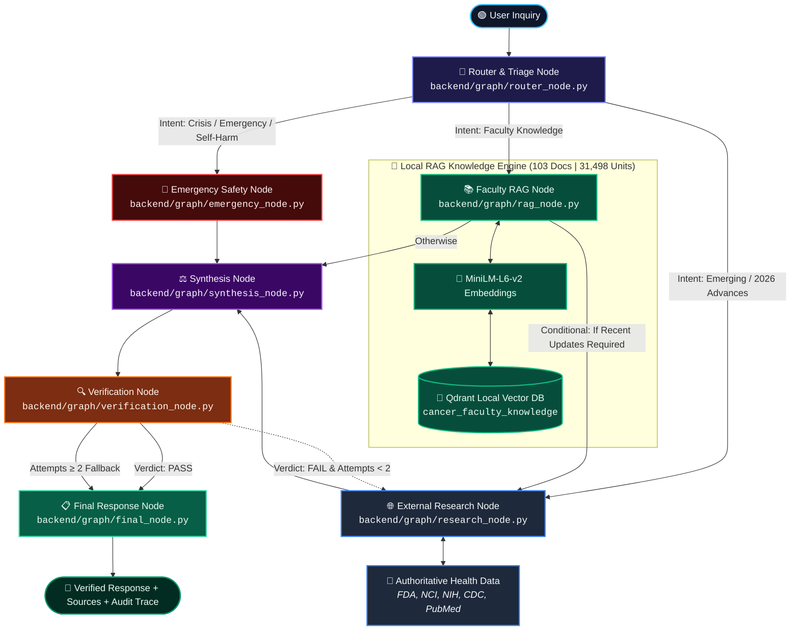
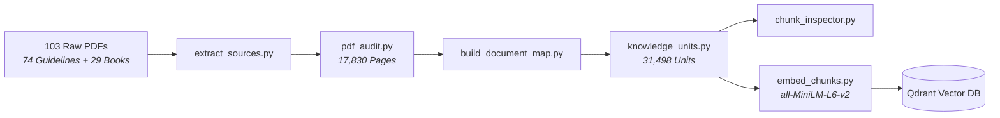

# 🏗️ Architecture Design

## 🌟 System Overview
The **Cancer Multi-Agent System** is an autonomous, state-driven multi-agent framework built with **LangGraph**, **FastAPI**, **Qdrant**, and **React 19**. It operates over a shared `AgentState` TypedDict to coordinate specialized agents, enforce deterministic emergency safety guardrails, ground inquiries in a 103-document faculty cancer corpus (31,498 knowledge units), and perform independent factual verification with automated retry loops.

---

## 🏛️ Compiled LangGraph StateGraph Architecture

```mermaid
flowchart TD
    classDef inputStyle fill:#0f172a,stroke:#38bdf8,stroke-width:2px,color:#f8fafc
    classDef triageStyle fill:#1e1b4b,stroke:#818cf8,stroke-width:2px,color:#f8fafc
    classDef emergStyle fill:#450a0a,stroke:#ef4444,stroke-width:2px,color:#fef2f2
    classDef ragStyle fill:#064e3b,stroke:#10b981,stroke-width:2px,color:#ecfdf5
    classDef resStyle fill:#1e293b,stroke:#3b82f6,stroke-width:2px,color:#f8fafc
    classDef synthStyle fill:#3b0764,stroke:#a855f7,stroke-width:2px,color:#faf5ff
    classDef verifStyle fill:#7c2d12,stroke:#f97316,stroke-width:2px,color:#fff7ed
    classDef finalStyle fill:#065f46,stroke:#34d399,stroke-width:2px,color:#ecfdf5
    classDef outStyle fill:#022c22,stroke:#059669,stroke-width:2px,color:#ecfdf5

    Start([🟢 User Inquiry]):::inputStyle --> Router[🧭 Router & Triage Node<br><code>backend/graph/router_node.py</code>]:::triageStyle
    
    %% Emergency Branch
    Router -->|Intent: Crisis / Emergency / Self-Harm| EmergencyNode[🚨 Emergency Safety Node<br><code>backend/graph/emergency_node.py</code>]:::emergStyle
    EmergencyNode --> SynthesisNode[⚖️ Synthesis Node<br><code>backend/graph/synthesis_node.py</code>]:::synthStyle

    %% RAG & Research Branches
    Router -->|Intent: Faculty Knowledge| RAGNode[📚 Faculty RAG Node<br><code>backend/graph/rag_node.py</code>]:::ragStyle
    subgraph RAG_Layer ["💾 Local RAG Knowledge Engine (103 Docs | 31,498 Units)"]
        RAGNode <--> EmbedModel[🧠 MiniLM-L6-v2 Embeddings]:::ragStyle
        EmbedModel <--> QdrantDB[(💾 Qdrant Local Vector DB<br><code>cancer_faculty_knowledge</code>)]:::ragStyle
    end

    Router -->|Intent: Emerging / 2026 Advances| ResearchNode[🌐 External Research Node<br><code>backend/graph/research_node.py</code>]:::resStyle
    ResearchNode <--> WebSources[🔎 Authoritative Health Data<br><em>FDA, NCI, NIH, CDC, PubMed</em>]:::resStyle

    RAGNode -->|Conditional: If Recent Updates Required| ResearchNode
    RAGNode -->|Otherwise| SynthesisNode
    ResearchNode --> SynthesisNode
    
    %% Synthesis & Verification Loop
    SynthesisNode --> VerifierNode[🔍 Verification Node<br><code>backend/graph/verification_node.py</code>]:::verifStyle

    VerifierNode -->|Verdict: PASS| FinalNode[📋 Final Response Node<br><code>backend/graph/final_node.py</code>]:::finalStyle
    VerifierNode -.->|Verdict: FAIL &amp; Attempts &lt; 2| ResearchNode
    VerifierNode -->|Attempts &ge; 2 Fallback| FinalNode

    FinalNode --> End([🏁 Verified Response + Sources + Audit Trace]):::outStyle
```

---

## 👥 Specialized Agent Roster

| Agent Persona | Module Path | Core Responsibilities | Grounding Source |
| :--- | :--- | :--- | :--- |
| **🧭 Router / Triage Agent** | `backend/agents/router_agent.py` `backend/graph/router_node.py` | Evaluates user intent, prioritizes emergency triage over general queries, detects required knowledge domains, and outputs a typed `RouterDecision`. | Deterministic rule-screening + Structured LLM Classification |
| **🚨 Emergency & Safety Agent** | `backend/agents/emergency_agent.py` `backend/safety/emergency_rules.py` | Detects self-harm, suicidal distress, and acute medical red flags; bypasses general RAG to provide calm, immediate safety instructions and crisis resources. | Deterministic Regex Keywords + Safe De-escalation Protocol |
| **📚 Faculty RAG Agent** | `backend/rag/rag_agent.py` `backend/graph/rag_node.py` | Queries local persistent Qdrant database, extracts semantic chunks, attributes page-level citations, and flags historical publication years (e.g. 2010/2018). | Local Qdrant Store (`cancer_faculty_knowledge`) |
| **🌐 External Research Agent** | `backend/agents/research_agent.py` `backend/graph/research_node.py` | Researches emerging oncology updates, newly approved 2026 therapies, and official regulatory changes with strict source date verification. | Live Web Tools + FDA, NCI, NIH, CDC Databases |
| **⚖️ Synthesis Agent** | `backend/agents/synthesis_agent.py` `backend/graph/synthesis_node.py` | Consolidates multi-source evidence into a cohesive, patient-friendly answer; explicitly highlights temporal differences and caveats without diagnosing or prescribing. | Provided Faculty RAG & External Research Evidence Only |
| **🔍 Verification Agent** | `backend/agents/verifier_agent.py` `backend/graph/verification_node.py` | Independently verifies proposed answers against supplied evidence, flags unsupported claims or omitted limitations, and controls the retry loop (`MAX_VERIFICATION_ATTEMPTS = 2`). | Raw Evidence Claims & Source Metadata |
| **📋 Final Response Builder** | `backend/graph/final_node.py` | Aggregates final formatted text, trace history of agents used, verification audit results, and deduplicated source citations. | Global `AgentState` |

---

## 🔬 Biomedical Knowledge & Ingestion Pipeline

```mermaid
flowchart LR
    PDFs[103 Raw PDFs<br><em>74 Guidelines + 29 Books</em>] --> Extractor[extract_sources.py]
    Extractor --> Auditor[pdf_audit.py<br><em>17,830 Pages</em>]
    Auditor --> DocMap[build_document_map.py]
    DocMap --> KU[knowledge_units.py<br><em>31,498 Units</em>]
    KU --> Inspector[chunk_inspector.py]
    KU --> Embedder[embed_chunks.py<br><em>all-MiniLM-L6-v2</em>]
    Embedder --> Qdrant[(Qdrant Vector DB)]
```

- **Extraction**: Partitions input into clean directory hierarchies (`patient_guidelines`, `oncology_references`).
- **Audit**: Checks readability of 17,830 pages across 103 PDF files.
- **Document Mapping**: Preserves page numbers, chapter headers, and section structure.
- **Knowledge Units**: Generates 31,498 bounded semantic chunks with 100% unique chunk IDs.
- **Embedding & Storage**: Vectors are indexed in Qdrant with cosine metric for sub-second retrieval.

---

## 🔒 Security & Data Privacy
- **Zero-PHI Guarantee**: Patient identifiers are not collected or retained.
- **On-Premises Vector Storage**: Local Qdrant instance prevents clinical text leaks.
- **Deterministic Crisis Intercept**: Emergency safety triggers execute locally before any model inference.
