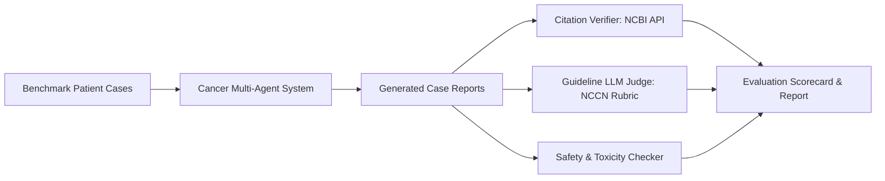

# 🧪 Evaluation Framework & Benchmarks

This document outlines the validation methodologies, benchmarking datasets, and quantitative metrics used to evaluate the **Cancer Multi-Agent System**.

---

## 🎯 Evaluation Objectives
1. **Clinical Accuracy & Guideline Concordance**: Ensure recommendations align with established oncology guidelines (NCCN, ASCO, ESMO).
2. **Citation Fidelity & Anti-Hallucination**: Verify that 100% of cited clinical evidence, PubMed IDs (PMIDs), and clinical trials (NCTs) exist and support the claims made.
3. **Multi-Agent Collaboration Efficacy**: Evaluate task routing, debate convergence, and the quality of specialist synthesis.
4. **Safety & Risk Mitigation**: Measure the system's ability to flag contraindications, toxicity risks, and inappropriate off-label regimens.

---

## 📊 Core Evaluation Metrics

| Metric Category | Metric Name | Definition / Formula | Target Threshold |
| :--- | :--- | :--- | :--- |
| **Evidence Grounding** | **Citation Precision** | $\frac{\text{Valid \& Relevant Citations}}{\text{Total Citations Generated}}$ | $\ge 98\%$ |
| **Evidence Grounding** | **Hallucination Rate** | $\frac{\text{Fabricated Facts/Citations}}{\text{Total Claims}}$ | $0\%$ |
| **Clinical Alignment** | **Guideline Concordance** | % agreement with NCCN/ASCO first-line recommendations | $\ge 90\%$ |
| **Precision Oncology** | **Biomarker Actionability Score** | Correct mapping of genomic alteration $\rightarrow$ targeted drug | $\ge 95\%$ |
| **Safety** | **Contraindication Recall** | $\frac{\text{Flagged Contraindications}}{\text{Known Benchmark Contraindications}}$ | $100\%$ |
| **System Performance**| **End-to-End Latency** | Full multi-agent consensus turnaround time | $\le 45\text{s}$ |

---

## 🗂️ Benchmark Datasets & Test Suites

### 1. Synthetic Tumor Board Cases (`data/benchmarks/synthetic_cases.json`)
A curated dataset of synthetic clinical oncology vignettes across major tumor types:
- Non-Small Cell Lung Cancer (NSCLC) – EGFR, ALK, KRAS G12C, PD-L1 variations.
- Breast Cancer – HR+/HER2-, HER2+, Triple Negative (TNBC), BRCA1/2 mutations.
- Colorectal Cancer (CRC) – MSS vs. MSI-H, BRAF V600E, KRAS/NRAS wildtype.
- Melanoma – BRAF V600E/K, immunotherapy refractory scenarios.

### 2. Citation Verification Test Suite (`tests/eval_citations.py`)
Automated script that extracts all PMIDs and NCT identifiers from agent outputs and verifies them against the official NCBI E-Utilities API and ClinicalTrials.gov API.

---

## 🔬 Automated Evaluation Pipeline

---

## 📈 Human-in-the-Loop (HITL) Expert Review
For clinical research verification, periodic blind reviews by clinical oncologists and oncology researchers are conducted using a structured Likert scale (1-5) evaluating:
- Clinical Relevance & Clarity
- Completeness of Differential Diagnosis
- Appropriateness of Trial Suggestions
- Overall Safety & Disclaimer Prominence
